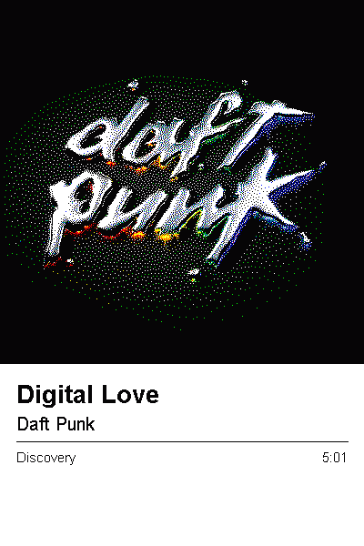

# deezer-epaper

Shows whatever I'm playing on Deezer on a Waveshare 4inch E Ink Spectra 6 panel.
The Mac figures out the track and renders a frame; the panel fetches it over
WiFi and draws it. No cable, no account, no API key.



Source on the left, what the panel prints on the right:


## How it works

```
Deezer  ->  macOS MediaRemote  ->  server  ->  /frame.bin  ->  ESP32  ->  panel
                                   renders     long poll       WiFi      ~20s
```

The track comes from **MediaRemote**, the private framework behind Control
Centre's Now Playing widget. It reports the player's own metadata - exact title,
artist, album, duration and a real playback rate - with no permission prompt and
whether the window is visible or not.

Since macOS 15.4 that API hands a nil dictionary to any caller that isn't an
Apple platform binary, so the code ships as a small dylib loaded by
`/usr/bin/perl`, which is one. No entitlement or signing involved.

macOS only exposes **one** now-playing client at a time, so a browser video
holding the slot hides Deezer completely. When that happens the server falls
back to reading Deezer's own window title, and discards the result unless the
Deezer catalogue corroborates it. That fallback is the only thing here that
needs a permission (Accessibility), and only in that case.

The panel **long-polls** `/frame.bin`: the server holds the request open until
the track changes, so a skip starts drawing about a second later. The frame's
CRC32 is its ETag, so an unchanged track costs a header exchange rather than
120 KB. What's left is the panel's own ~20.5 s six-ink refresh.

The frame is never held in RAM on the ESP32 - 120,000 bytes doesn't fit in the
largest contiguous block - so it streams from the socket straight to the panel.

## Dithering

Six inks, one per pixel, and about a 30:1 contrast ratio. Every intermediate
colour comes from spatial dithering, so most of the work is in choosing what the
matcher aims at.

`/tune` gives you the source and the panel output side by side, the six ink
values as editable hex, and a switch per processing stage:

- **Blend** between pure primaries and muted real-ink values. Keep it low.
  Aiming at primaries the panel can't actually make leaves a large residual
  everywhere, which keeps the diffusion mixing; aiming at the real inks puts
  colours where they land but collapses areas into flat patches.
- **Keep greys neutral** - only acts where the *source* is near-neutral, so
  silver stops resolving to blue without suppressing saturated mixes.
- **Black point** - crushes near-blacks before dithering, so a dark background
  doesn't scatter stray bright dots.
- Brightness, contrast, saturation, and the kernel.

Settings are global and want tuning per image; different covers genuinely want
different treatment. [docs/epaper-rendering.md](docs/epaper-rendering.md) has
the measurements behind all of this, including a few things that turned out to
be wrong.

## Setup

```sh
pip3 install -r requirements.txt
python3 server/server.py            # http://localhost:8766
```

The MediaRemote adapter builds itself on first run (needs clang).

For the panel:

```sh
cp firmware/src/secrets.h.example firmware/src/secrets.h   # WiFi + server URL
pio run -d firmware -t upload
```

Then turn on **Serve Frames over Wi-Fi** in the menu bar app, or run the server
with `--bind 0.0.0.0`. That's off by default because it puts the current track
and the rendered frame on your local network.

Menu bar app:

```sh
swiftc -O -o "Now Playing.app/Contents/MacOS/NowPlaying" menubar/main.swift
```

## Hardware

- Waveshare 4inch e-Paper HAT+ (E), E Ink Spectra 6, 400x600
- ESP32-D0WDQ6 (esp32dev), 4 MB flash, no PSRAM
- Panel at 3.3 V. DIN 14, CLK 13, CS 15, DC 27, RST 26, BUSY 25, PWR 33

There is no documented minimum interval between refreshes - the widely repeated
180 s figure is reseller boilerplate. Good Display document the opposite: refresh
at least once every 24 hours or the image burns in.

## Why not the Deezer API

There's no now-playing endpoint. `/user/me/history` and `/user/me/flow` exist and
need OAuth; `/user/me/player` and `/user/me/nowplaying` return
`InvalidQueryException` - they don't exist. History records completed plays only.

Deezer also closed API registration to individuals in October 2025, and its
Last.fm bridge is batched by minutes to hours. Live playback is only observable
on the device playing it, which is why this reads the Mac.

## Licence

MIT.

## Measuring it

`tools/benchmark.py` characterises each setting over a fixed cover set. The
protocol matters more than the numbers: the simulation palette is held constant
so only the matcher varies, one parameter is swept at a time, and both the mean
and the **worst cover** are reported.

```sh
python3 tools/benchmark.py --covers covers --all
python3 tools/benchmark.py --covers covers --sweep blend
```

The primary metric is hue error - chroma-weighted hue-angle error in CIELAB
after an eye-model blur, measured only where the source has real chroma. Mean dE
and coloured-ink share both miss the failure that matters most here: a cyan
subject rendering as solid green.

Reporting the worst cover rather than the mean is not a detail. A mean over a
varied set hides one colour category failing completely - CIEDE2000 matching
scored fine on average while turning every magenta field blue.

Results are in [docs/epaper-rendering.md](docs/epaper-rendering.md).
